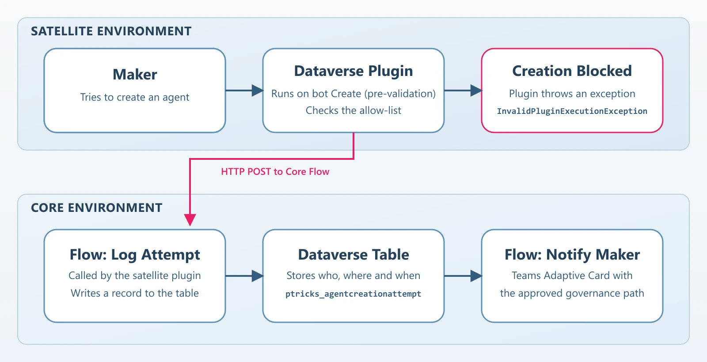

# Agent Creation Blocker

The **Agent Creation Blocker** blocks Copilot Studio agent creation at the environment level — something the native Power Platform controls cannot cleanly do. It intercepts the creation at the Dataverse layer with a plugin, logs every attempt in a central Dataverse table, and notifies the blocked maker with a configurable Teams Adaptive Card.

This README is the **technical setup reference**. For the rationale, when to use it, the maker experience, and how the pattern extends further, see the blog post: https://www.powertricks.io/block-agent-creation



## How it works
1. A maker tries to create an agent; Copilot Studio writes a record into the `bot` table.
2. The **satellite** plugin runs on `Create` of `bot` (PreValidation stage) and evaluates the maker against the allow-list.
3. The plugin calls the **core** logging flow (HTTP POST) to record the attempt.
4. If the maker is not allowed, the plugin throws an `InvalidPluginExecutionException`, so the `bot` write is rolled back and creation fails.
5. The core notification flow posts the Teams Adaptive Card to the maker and marks the attempt as notified.

> **Note:** This relies on current platform behavior — Copilot Studio writing the new agent into the `bot` table at creation time. That behavior is not officially documented, so a future platform change could stop the interception from firing. If that happens the block simply stops taking effect; uninstalling the satellite solution removes the control entirely, with no residual effect on agent creation.

## Solution components
The control ships as two solutions. Both are provided as Managed and Unmanaged packages.

### `BlockAgentCreationCore` — installed once, in a central environment
| Component | Logical name | Purpose |
|---|---|---|
| Table | `ptricks_agentcreationattempt` | Central log of every attempt (see [columns](#the-attempt-table)) |
| Model-driven app | `Agent Creation Attempt` | Review logged attempts |
| Cloud flow | `bac - Log Agent Creation Attempt` | HTTP-triggered; called by the satellite plugin, writes the attempt record |
| Cloud flow | `bac - Notify Maker After Block` | Dataverse-triggered; posts the Teams Adaptive Card, then marks the attempt notified |
| Environment variable | `ptricks_AgentCreationCardSettings` | JSON driving the Teams card (see [Configuration](#configuration)) |
| Connection references | Microsoft Dataverse, Office 365 Users, Power Platform for Admins, Microsoft Teams | Used by the two core flows |

### `BlockAgentCreationSat` — installed in every blocked environment
| Component | Logical name | Purpose |
|---|---|---|
| Plugin assembly | `BlockAndLogAgentCreation.dll` | Contains the blocking plugin |
| Plugin step | `Create of bot` (PreValidation) | Intercepts agent creation |
| Cloud flow | `bac - Auto Turn On Plugin Step` | Self-healing: re-enables the plugin step if it is disabled |
| Environment variable | `ptricks_AgentCreationLoggingFlowUrl` | Core logging-flow endpoint to POST attempts to |
| Environment variable | `ptricks_AgentCreationBlockMessage` | Exception message thrown when creation is blocked |
| Environment variable | `ptricks_AgentCreationAllowedEmailContains` | Comma-separated allow-list of email patterns |
| Connection reference | Microsoft Dataverse | Used by the self-healing flow |

## Pre-requisites
- Dataverse-enabled environments (one central + each environment to block).
- An account with the Power Platform Administrator role to import the solutions and create the connections.
- Connections available in the central environment for: Microsoft Dataverse, Office 365 Users, Power Platform for Admins, and Microsoft Teams. In each blocked environment: Microsoft Dataverse.
- A premium license for the account owning the flows.

## Setup
Set up the core once, configure the satellite in that same central environment, then export the configured satellite and distribute it to each blocked environment.

### 1. Install and configure the core solution
1. Import `BlockAgentCreationCore` into the central environment and set the connection references when prompted.
2. Set the `ptricks_AgentCreationCardSettings` environment variable (see [Configuration](#configuration)).
3. Turn on both flows (`bac - Log Agent Creation Attempt`, `bac - Notify Maker After Block`).
4. Open `bac - Log Agent Creation Attempt` and copy the URL of its **When an HTTP request is received** trigger — the satellite needs it.

### 2. Install and configure the satellite solution (same central environment)
Install the satellite in the central environment first so it can be configured once, then exported ready-to-deploy.
1. Import `BlockAgentCreationSat` and set its Dataverse connection reference.
2. Set the satellite environment variables:
   - `ptricks_AgentCreationLoggingFlowUrl` → the logging-flow URL copied above.
   - `ptricks_AgentCreationBlockMessage` → the exception message to throw.
   - `ptricks_AgentCreationAllowedEmailContains` → the allow-list (comma-separated email patterns; leave empty to block everyone).
3. Turn on the `bac - Auto Turn On Plugin Step` flow.

### 3. Distribute to each blocked environment
1. Export the configured satellite solution.
2. Import it into every environment where agent creation should be blocked, setting the Dataverse connection and confirming/overriding the environment variables per environment.
3. Turn on the `bac - Auto Turn On Plugin Step` flow in each.
4. For repeatable rollout at scale, pair it with the [Solution Deployer](https://www.powertricks.io/solution-deployer) — no pipeline or Managed Environments required.

Because the exception message and allow-list are environment variables, each blocked environment can be tuned independently without touching the others or the plugin code.

## Configuration
All per-environment behavior is exposed through environment variables — no plugin code changes required.

| Environment variable | Solution | Controls |
|---|---|---|
| `ptricks_AgentCreationCardSettings` | Core | JSON driving the Teams Adaptive Card (see below) |
| `ptricks_AgentCreationLoggingFlowUrl` | Satellite | Core logging-flow endpoint each satellite POSTs to |
| `ptricks_AgentCreationBlockMessage` | Satellite | Exception message thrown when creation is blocked |
| `ptricks_AgentCreationAllowedEmailContains` | Satellite | Comma-separated email patterns; a match allows creation (still logged) |

### Notification card JSON
`ptricks_AgentCreationCardSettings` is a single JSON object. `IntroText` supports the `{AgentName}` and `{EnvironmentName}` tokens, substituted at runtime. Each `Links` entry has a `Title`, a `Url`, and an optional `Style` (e.g. `positive`, `destructive`; omit for the default). Below is the default value shipped with the solution — replace the image, texts and links with your own governance guidance.

```json
{
  "CardImageLink": "https://sappg.blob.core.windows.net/images/bac%20-%20adaptive%20card%20banner.png",
  "TitleText": "🛑 Agent creation blocked in this environment",
  "IntroText": "Hi, we noticed you tried to create the agent **{AgentName}** in **{EnvironmentName}**. This environment isn't approved for building Copilot Studio agents, so your request was blocked. No action is needed on your side.",
  "NextStepsText": "To build your agent, please switch to an **approved environment**. If you're not sure which one to use — or you believe this environment *should* be approved — the resources below will point you in the right direction. Our CoE team is happy to help.",
  "Links": [
    {
      "Title": "📄 View approved environments & governance",
      "Url": "https://www.powertricks.io",
      "Style": "positive"
    },
    {
      "Title": "✉️ Contact the CoE team",
      "Url": "mailto:Power.Platform@powertricks.io"
    }
  ]
}
```

## Keeping the control enabled
Any user with the Environment Maker role can disable a plugin step, which would silently switch off the control. The satellite's `bac - Auto Turn On Plugin Step` flow watches the step and re-enables it automatically; makers do not have access to that flow. Disabling the control on purpose is therefore a deliberate admin action:
- Turn off `bac - Auto Turn On Plugin Step` first, then disable the plugin step, or
- Delete the satellite solution from the environment altogether.

## The attempt table
Every attempt (blocked or allowed) is written to `ptricks_agentcreationattempt` in the central environment and can be reviewed through the `Agent Creation Attempt` model-driven app. Key columns:

| Column | Content |
|---|---|
| `ptricks_agentdisplayname` | Name of the agent the maker tried to create |
| `ptricks_attemptedby` / `ptricks_attemptedbyentraobjectid` | The maker (lookup and Entra object id) |
| `ptricks_environmentdisplayname` / `ptricks_environmentid` | Environment where creation was attempted |
| `ptricks_attemptedon` | Timestamp of the attempt |
| `ptricks_blocked` | Whether the attempt was blocked or allowed via the allow-list |
| `ptricks_notificationstatus` | Teams notification state (e.g. Not needed / Completed) |

See the [blog post](https://www.powertricks.io/block-agent-creation) for how to use this signal for governance and enablement.
