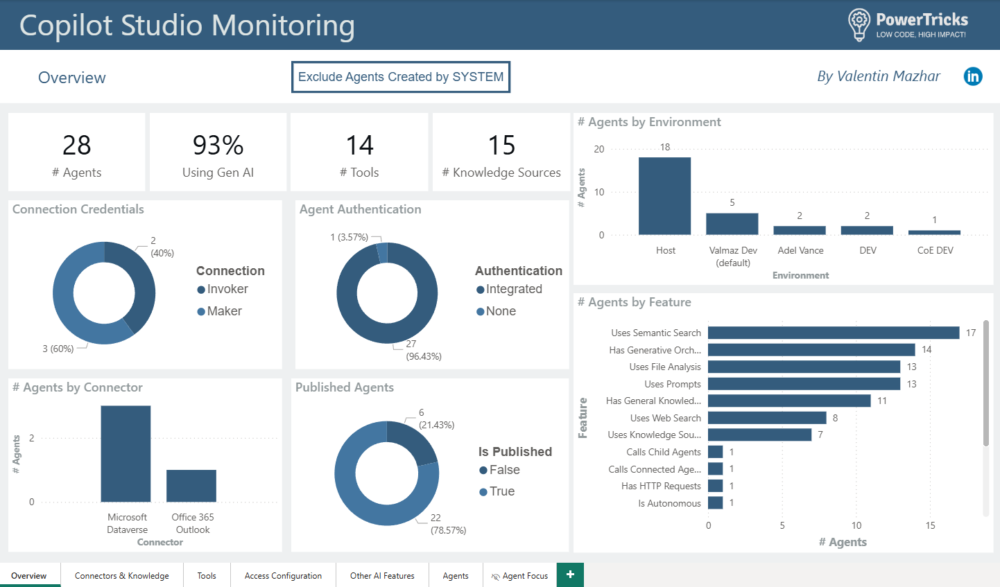

# Copilot Studio Monitor

The **Copilot Studio Monitor** solution extends the CoE Starter Kit data model to surface detailed configuration for Copilot Studio agents (topics, tools, connectors, knowledge sources, autonomy flags, access/auth settings, etc.) in a structured, reportable way. It closes current visibility gaps until Microsoft ships a unified agent observability layer.

More background, rationale and screenshots are in the related blog post: https://powertricks.io/copilot-studio-monitor

## Pre-requisites
- Tenant using Copilot Studio (agents created from the Copilot Studio portal)
- CoE Starter Kit (core) installed in an environment
- Account with Power Platform Administrator role to insteall the solution and create connections
- Power BI Desktop (to open the included `.pbit` template)

## What’s Included
- Customized sync cloud flow (based on CoE Kit PVA sync) enriching agent & component data
- Extended CoE tables: PVA Bot & PVA Bot Component with extra columns populated from native `bot` / `botcomponent` tables
- Power BI Template: transforms YAML component definitions and reports on agents configuration across the tenant

## Install the Solution
1. Download the solution package (Managed or Unmanaged) `CustomCoreEnhancedAgentsMetadata` from this repository.
2. Import into the CoE Kit environment.
3. Configure required connections when prompted
4. Turn off the original PVA Sync Flow from the CoE Kit `Admin | Sync Template v4 (PVA)`
5. Turn on the customized sync flow from the solution `Custom | Sync Template v4 (PVA)`.
6. Open the default solution and set  Environment Variable `FullInventory` to `Yes` (only needed for the first run).
7. Run the customized sync flow (and set the variable `FullInventory` to `No` afterwards).
8. Open the `Copilot Studio Monitor Template.pbit` in Power BI Desktop and provide the Dataverse connection parameter.
6. Refresh to load agent & component data and publish if appropriate.

## Using the Power BI Report
- Overview & drill-through pages let you navigate from aggregate visuals down to individual agent configuration.
- Toggle inclusion/exclusion of SYSTEM-created agents to focus on user-created assets.
- Drill-through from any visual to the Agents table, then to a single Agent focus page listing related triggers, knowledge sources, tools, connectors, etc.
- Use filters to identify agents with sensitive configurations (e.g., Web Search enabled, unauthenticated endpoints, autonomous execution).

## Learn More
Full context, screenshots, and reasoning are in the blog article: https://powertricks.io/copilot-studio-monitor