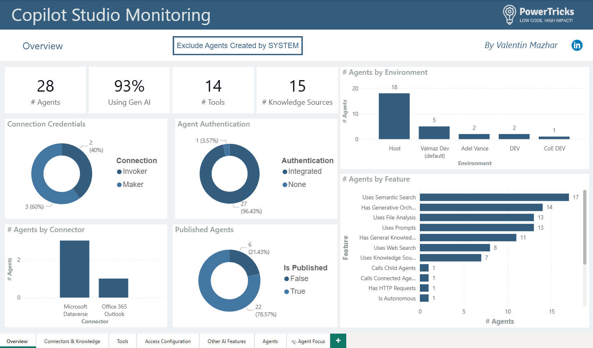

# Copilot Studio Monitor

The **Copilot Studio Monitor** solution extends the CoE Starter Kit data model to surface detailed configuration and credits consumption for Copilot Studio agents (topics, tools, connectors, knowledge sources, autonomy flags, access/auth settings, etc.) in a structured, reportable way. It closes current visibility gaps until Microsoft ships a unified agent observability layer.

Two Power BI template variants are available: a **core template** reporting on agent configuration, and a **"with Usage" template** that adds Copilot Credits consumption reporting (requires the PPAC Reports Extractor solution).

More background, rationale and screenshots are in the related blog post: https://powertricks.io/copilot-studio-monitor

## Pre-requisites
- Tenant using Copilot Studio (agents created from the Copilot Studio portal)
- CoE Starter Kit (core) installed in an environment
- Account with Power Platform Administrator role to install the solution and create connections
- Power BI Desktop (to open the included `.pbit` template)
- **For the "with Usage" template only:** latest [PPAC Reports Extractor](https://github.com/ValentinMaz/Power-Platform-Samples/tree/main/PPAC%20Reports%20Extractor) solution installed

## What’s Included
- Customized sync cloud flow (based on CoE Kit PVA sync) enriching agent & component data
- Extended CoE tables: PVA Bot & PVA Bot Component with extra columns populated from native `bot` / `botcomponent` tables
- Two Power BI Templates:
  - `Copilot Studio Monitor Template.pbit` — reports on agent configuration across the tenant (topics, tools, connectors, knowledge sources, access settings, etc.)
  - `Copilot Studio Monitor Template with Usage.pbit` — includes everything above plus Copilot Credits consumption reporting (requires PPAC Reports Extractor)

## Install the Solution
1. Download the solution package (Managed or Unmanaged) `CustomCoreEnhancedAgentsMetadata` from this repository.
2. Import into the CoE Kit environment.
3. Configure required connections when prompted
4. Turn off the original PVA Sync Flow from the CoE Kit `Admin | Sync Template v4 (PVA)`
5. Turn on the customized sync flow from the solution `Custom | Sync Template v4 (PVA)`.
6. Open the default solution and set  Environment Variable `FullInventory` to `Yes` (only needed for the first run).
7. Run the customized sync flow (and set the variable `FullInventory` to `No` afterwards).
8. Open the appropriate Power BI template in Power BI Desktop and provide the Dataverse connection parameter:
   - `Copilot Studio Monitor Template.pbit` for agent configuration reporting only. You will need to provide the CoE Kit Environment Url to set up the template
   - `Copilot Studio Monitor Template with Usage.pbit` if you have [PPAC Reports Extractor](https://github.com/ValentinMaz/Power-Platform-Samples/tree/main/PPAC%20Reports%20Extractor) installed and want Copilot Credits consumption reporting. In addition to the CoE Kit Environment Url, you will also have to provide the SharePoint site url used to store the consumption reports by the PPAC Reports Extractor.
9. Refresh to load agent & component data and publish if appropriate.

## Using the Power BI Report
- Overview & drill-through pages let you navigate from aggregate visuals down to individual agent configuration.
- Toggle inclusion/exclusion of SYSTEM-created agents to focus on user-created assets.
- Drill-through from any visual to the Agents table, then to a single Agent focus page listing related triggers, knowledge sources, tools, connectors, etc.
- Use filters to identify agents with sensitive configurations (e.g., Web Search enabled, unauthenticated endpoints, autonomous execution).
- Copilot Credits consumption pages are available in the "with Usage" template only.

## Learn More
Full context, screenshots, and reasoning are in the blog article: https://powertricks.io/copilot-studio-monitor